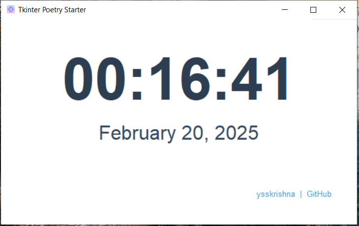

# Tkinter Poetry Starter

A professional template for building cross-platform desktop applications using Python's Tkinter and Poetry. This template serves as the foundation for production-ready GUI applications, as demonstrated by projects like [Directory Printer](https://github.com/ysskrishna/directory-printer) which was built using this starter.

<a href="https://www.producthunt.com/posts/tkinter-poetry-starter-template?embed=true&utm_source=badge-featured&utm_medium=badge&utm_souce=badge-tkinter&#0045;poetry&#0045;starter&#0045;template" target="_blank"></a>

> 🚀 **Quick Start:** Check out the [Development Guide](DEVELOPMENT.md) for installation and setup


> 🛠️ **New Project:** Follow the [Customization Guide](CUSTOMIZATION_GUIDE.md) to make it your own

## Media



## Why This Template?

This template was created to help developers quickly bootstrap production-quality desktop applications. It eliminates the common setup hurdles and provides a solid foundation with below features:


## Features

- **Cross-Platform Compatibility** - Runs on Windows, Linux, and macOS
- **Automated Builds** - GitHub Actions workflow for automatic binary creation on release
- **Developer Friendly**
  - Pre-commit hooks for code quality
  - Comprehensive documentation
  - Easy-to-use commands for running and building
- **Professional Project Structure**
  - Uses Poetry for dependency management
  - Organized module structure with separate core and GUI components
  - Pre-configured development tools (Black, isort, pylint)
- **Project Assets & Documentation**
  - Custom application logo included
  - Detailed changelog for version tracking


## Project Structure

```
tkinter-poetry-starter/
├── src/                            # Source code directory
│   ├── assets/                     # Application assets (images, icons, etc.)
│   ├── core/                       # Core business logic and utilities
│   └── gui/                        # GUI-related code and window definitions
├── .github/                        # GitHub-specific configurations
│   └── workflows/                  # CI/CD workflow definitions
├── dist/                           # Built application binaries
├── .gitignore                      # Git ignore rules
├── .pre-commit-config.yaml         # Pre-commit hook configurations
├── CHANGELOG.md                    # Version history and changes
├── CUSTOMIZATION_GUIDE.md          # Instructions for customizing the current template
├── DEVELOPMENT.md                  # Development guide and instructions
├── LICENSE                         # MIT license file
├── poetry.lock                     # Lock file for dependencies
├── pyproject.toml                  # Project metadata and dependencies
├── README.md                       # Project documentation (this file)
└── tkinter_poetry_starter.spec     # PyInstaller specification file
```

### Key Files and Their Purpose

- **src/core/**: Contains the core business logic, data models, and utility functions that are independent of the GUI
- **src/gui/**: Houses all Tkinter-related code, window definitions, and UI components
- **src/assets/**: Stores static assets like images, icons, and other resources used by the application
- **.github/workflows/**: Contains GitHub Actions workflow files for automated builds and releases
- **.pre-commit-config.yaml**: Defines pre-commit hooks for code quality checks (Black, isort, pylint)
- **CHANGELOG.md**: Tracks version history and notable changes in each release
- **CUSTOMIZATION_GUIDE.md**: Instructions for customizing the current template
- **DEVELOPMENT.md**: Guidelines and instructions for developers to setup and run the project
- **poetry.lock & pyproject.toml**: Poetry dependency management and project configuration files
- **tkinter_poetry_starter.spec**: PyInstaller configuration for building standalone executables

For installation and development instructions, please see [DEVELOPMENT.md](DEVELOPMENT.md).


## MIT License

Copyright (c) 2025 [Y. Siva Sai Krishna](https://github.com/ysskrishna)

Permission is hereby granted, free of charge, to any person obtaining a copy
of this software and associated documentation files (the "Software"), to deal
in the Software without restriction, including without limitation the rights
to use, copy, modify, merge, publish, distribute, sublicense, and/or sell
copies of the Software, and to permit persons to whom the Software is
furnished to do so, subject to the following conditions:

The above copyright notice and this permission notice shall be included in all
copies or substantial portions of the Software.

THE SOFTWARE IS PROVIDED "AS IS", WITHOUT WARRANTY OF ANY KIND, EXPRESS OR
IMPLIED, INCLUDING BUT NOT LIMITED TO THE WARRANTIES OF MERCHANTABILITY,
FITNESS FOR A PARTICULAR PURPOSE AND NONINFRINGEMENT. IN NO EVENT SHALL THE
AUTHORS OR COPYRIGHT HOLDERS BE LIABLE FOR ANY CLAIM, DAMAGES OR OTHER
LIABILITY, WHETHER IN AN ACTION OF CONTRACT, TORT OR OTHERWISE, ARISING FROM,
OUT OF OR IN CONNECTION WITH THE SOFTWARE OR THE USE OR OTHER DEALINGS IN THE
SOFTWARE.